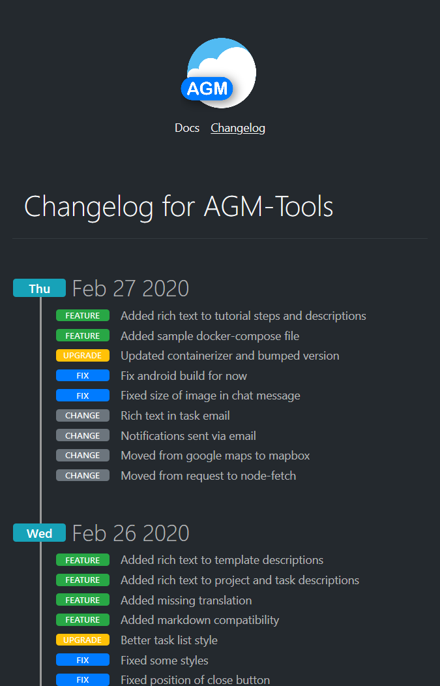
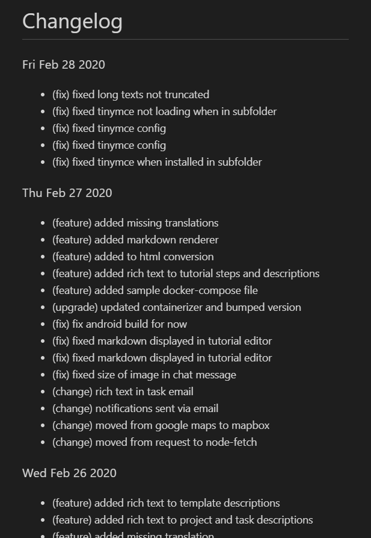
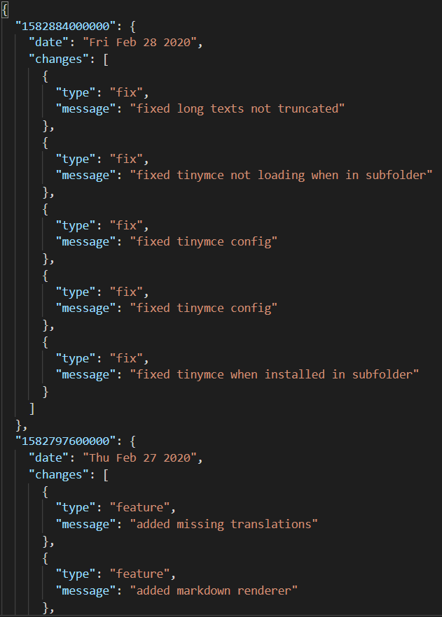

# ChangelogJS

This is a small customizable changelog generator.

It generates the changelog based on **commit messages**, not on release notes.

The following modes are avalible:
| HTML | MD | JSON |
| ---- | -- | ---- |
| `html-gh` | `md` | `json` |
|  |  |  |

## Installation
Type `npm install @hrueger/changelogjs --global` into your terminal.

## Usage
`changelogjs` without any options. If a `changelogjs.json` file is found in the current folder or above, this is used as the configuration instead of the default values (see below).

## Configuration
Create a `changelogjs.json` file ans specify the options below:

| Option | Description | Default |
| ------ | ----------- | ------- |
| `title` | The title of the Markdown and HTML page. | `Changelog for your App` |
| `logoUrl` | The url of a Logo image to be displayed at the top of the HTML page. | Some placeholder image. |
| `logoAlt` | The alternative text for the logo. | `Logo` |
| `sort` | A `boolean` value whether the commit messages of one day should be sorted after their type or not. | `true` |
| `ignoreAuthors` | An `array` of `string` values with authors which should be ignored. | `["greenkeeper[bot]"]` |
| `headerLinks` | An array of `{url: "someUrl", text: "text to be displayed", active: false|true}` objects to be displayed as links in the header of the HTML page. | `[{url: "/", text: "Docs"}, {url: "#", text: "Changelog", active: true}]` |
| `footerLinks` | An array of `{url: "someUrl", text: "text to be displayed"}` objects to be displayed as links in the footer of the HTML page. | `[{url: "#", text: "View on GitHub"}, {url: "https://github.com/hrueger/changelogjs", text: "Generated by ChangelogJS"}]` |
| `modes` | An array of `{mode: "md"|"json"|"html-gh", file: "someFileName.ext"}` objects defining which output files with which modes should be generated. See above for the avalible modes. | `[{mode: "md", file: "CHANGELOG.md"}, {mode: "json", file: "CHANGELOG.json"}, {mode: "html-gh", file: "CHANGELOG.html"}]` |

## Contribute
Feel free to report any issues on GitHub or add new modes / features and create a pull request!

## License
MIT
